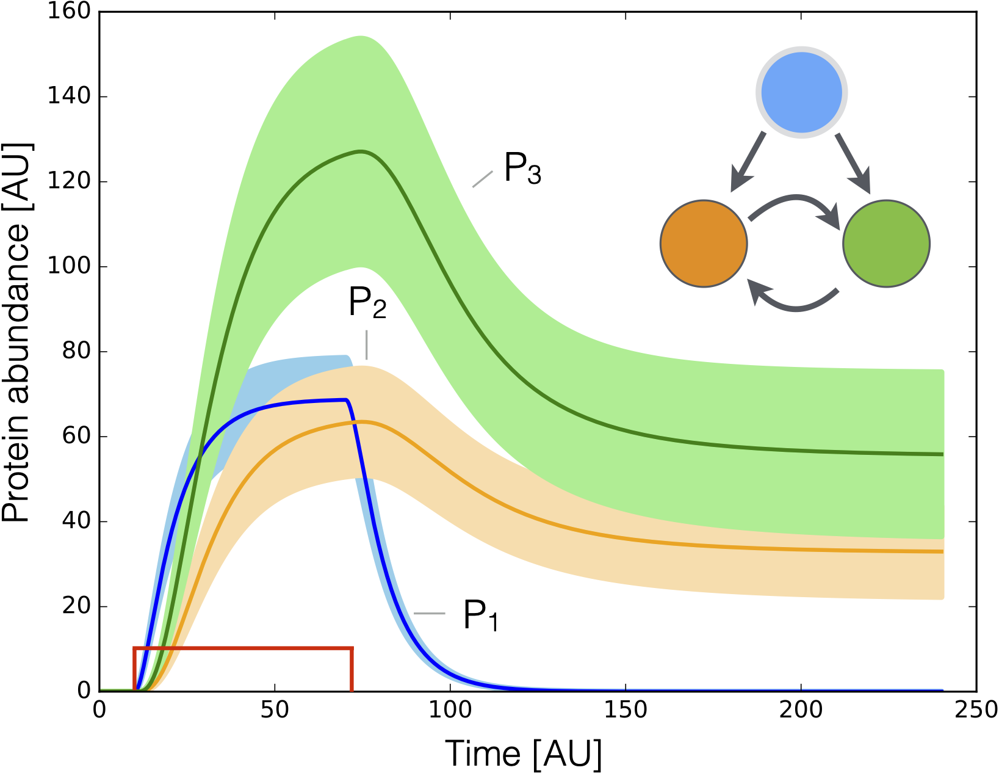

# Lab 9b: Single-Step Ordinary Differential Equation Solvers
This lab aims to implement some standard single-step ordinary differential equation solvers.
The case study that we simulate is a three-gene memory network.

<!--  -->

In this network, gene 1 is induced by an external activator. Gene 1 induces the expression of gene 2 and gene 3. 
However, gene 2 and gene 3 activate each other. The dynamics of the network are given by the following ordinary differential equations:

$$
\begin{equation}
\frac{dP_{i}}{dt} = \alpha_{i}\cdot{u}_{i}(\dots) - k_{d,i}\cdot{P_{i}},\quad{i=1,2,3}
\end{equation}
$$

where $P_{\star}$ denotes the gene product of gene $\star$, $u_{\star}(\dots)$ is the gene expression control functions, $\alpha_{\star}$ is the maximum transcription rate, and $k_{d,\star}$ is the degradation rate of protein $\star$.

## Task 1: Implement the Forward Difference Method
__Duration 30 min__: Implement the forward difference method to solve the ordinary differential equations of the three-gene memory network. Put your forward difference implementation in the `_solve(problem::MySimpleProblemModel, solver::MyForwardEulerMethod)::Tuple{Array{Float64,1}, Array{Float64,2}}` function. 
* The right-hand side of the ordinary differential equations can be evaluated using the `model` field of the `problem::MySimpleProblemModel` object. 
* After completing the implementation, execute the `runme_task_1.jl` script to test your implementation. This script will plot the protein values of the three-gene memory network.

## Task 2: Implement a Washout Script
__Duration 20 min__: Implement a washout simulation in the `runme_task_2.jl` script to simulate the three-gene memory network without the activator. The washout script should start at the end of the `runme_task_1.jl` script. 
* In the `runme_task_2.jl` script, set the activator to zero, the initial condition to the steady state of the three-gene memory network at the last time point, the simulation start time to the end of the time generated from `runme_task_1.jl` , and the stop time to 720-time units, same time step.
